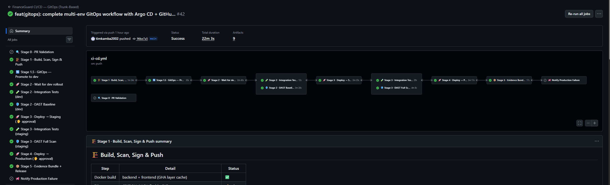
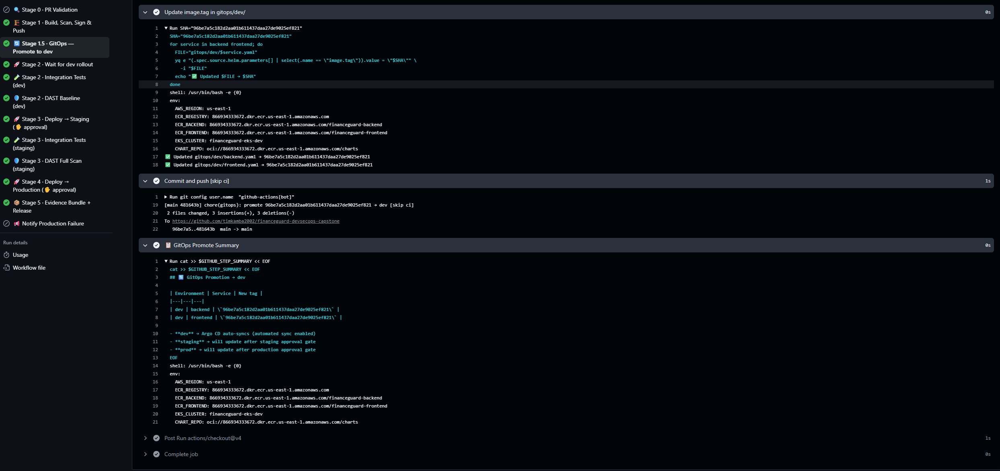
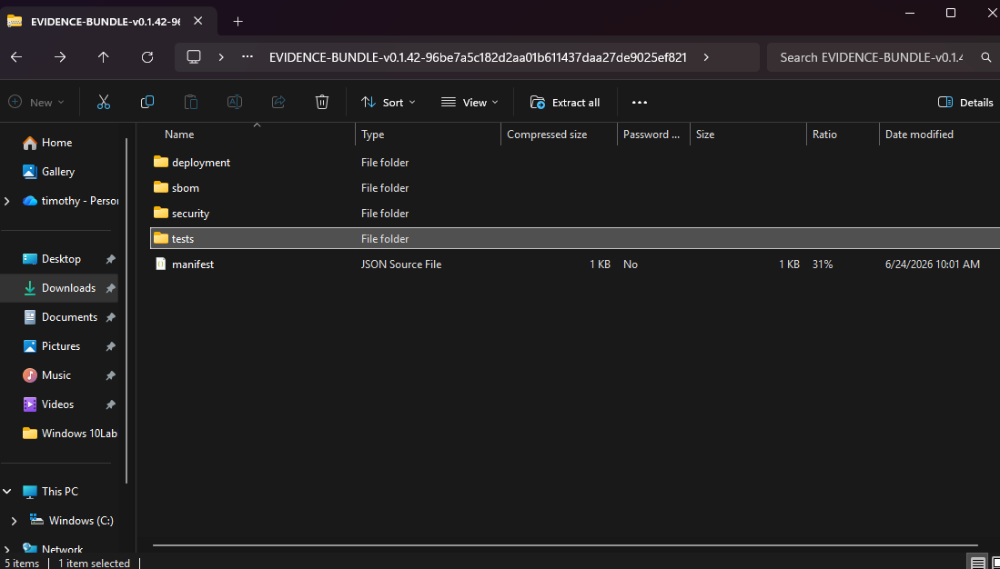
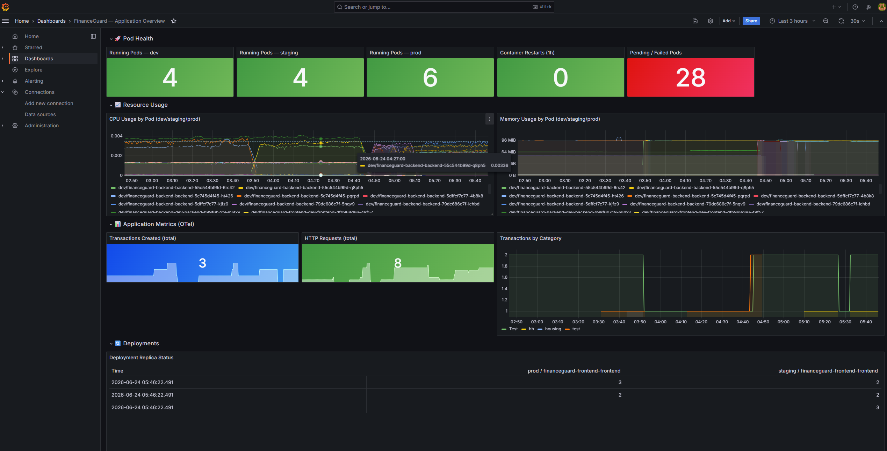
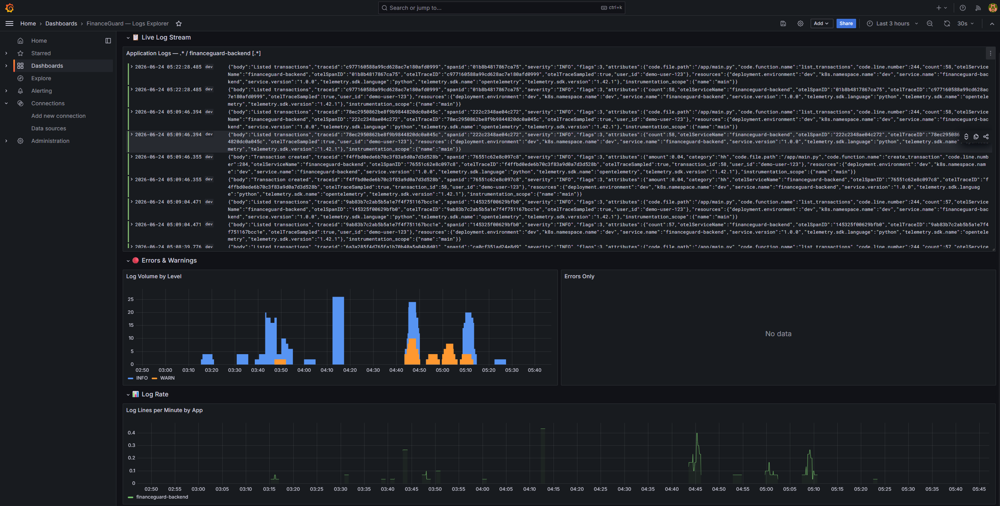

# FinanceGuard — DevSecOps Capstone

One-line summary
---------------
A production-oriented DevSecOps pipeline for a simple personal finance application — demonstrating infrastructure-as-code, supply-chain security, GitOps deployment, and full-stack observability across three isolated environments on AWS EKS.

Project goals / objectives
--------------------------
This capstone demonstrates that I can design, build, and operate a secure, observable, and auditable software delivery pipeline that meets typical DevSecOps learning objectives:

- Implement reproducible infrastructure with Infrastructure-as-Code (Terraform).
- Build a CI pipeline that enforces shift-left security (SAST, secret scanning, IaC scanning).
- Produce SBOMs and cryptographic image signatures for supply-chain assurance.
- Adopt GitOps (Argo CD) as the single source of truth for runtime state with controlled promotion gates.
- Provide three fully isolated environments (dev, staging, prod) with appropriate sync and approval policies.
- Instrument the application for the three observability signals (metrics, logs, traces).
- Deploy runtime security policies and detection (Kyverno + Falco) to enforce and monitor cluster behavior.
- Produce an evidence bundle for assessment and reproducibility.

Architecture overview
---------------------
FinanceGuard is intentionally small (FastAPI backend + PostgreSQL + static frontend) so the project demonstrates platform and process.

High-level architecture (text diagram)
- Developer pushes code → GitHub Actions pipeline runs validation, build, scans, signs, and writes image tags to the GitOps repo.
- Argo CD (app-of-apps) watches the GitOps repo and syncs Kubernetes manifests (dev / staging / prod).
- AWS EKS (Fargate) runs apps in namespaces; Observability components (Prometheus, Loki, Tempo, Grafana) run in a monitoring namespace.
- Runtime security enforced by Kyverno admission policies and Falco runtime detection. Secrets are provided by External Secrets Operator from AWS Secrets Manager.

Simple diagram (conceptual)
Developer (git push)
     │
     ▼
GitHub Actions → [PR checks | Build/Scan/Sign | Write image tag to gitops/]
     │
     ▼
gitops/ (committed image tag) → Argo CD (app-of-apps)
     │
     ▼
AWS EKS (namespaces: dev, staging, prod, monitoring)
 - backend (FastAPI) + frontend (static served by nginx)
 - RDS PostgreSQL per environment (credentials via External Secrets)
 - Observability: Prometheus → Grafana, Loki (logs), Tempo (traces), OTel Collector

Technology stack
-----------------
| Category | Tool / Component | Purpose |
|---|---:|---|
| Cloud | AWS EKS (Fargate) | Serverless Kubernetes runtime |
| IaC | Terraform | Cluster, VPC, RDS, ECR provisioning |
| CI/CD | GitHub Actions | Build, test, scan, sign, promote |
| GitOps | Argo CD | Declarative deployer reading gitops/ |
| Packaging | Helm | Parameterized K8s manifests |
| Registry | Amazon ECR | Container image + OCI artifacts |
| Secret scan | Gitleaks | Git secret scanning on PRs |
| SAST | Semgrep | App-level rule checks (OWASP Top 10) |
| IaC scan | Checkov | Terraform misconfiguration checks |
| Container scan | Trivy | Image CVE scanning |
| SBOM | Syft | SPDX 2.3 SBOM generation |
| Image signing | Cosign | OIDC keyless image signing |
| DAST | OWASP ZAP | Baseline (dev) and active (staging) scans |
| Quality gate | SonarCloud | Coverage & security hotspots |
| Policy engine | Kyverno | Admission control policies (non-root, limits, registry allow-list) |
| Runtime security | Falco | Syscall-level anomaly detection |
| Secret management | External Secrets Operator | AWS Secrets Manager → K8s secrets |
| Metrics | Prometheus + kube-prometheus-stack | Cluster & app metrics |
| Logs | Loki | Structured log aggregation |
| Traces | Tempo | Distributed traces |
| Telemetry pipeline | OpenTelemetry Collector | Central collector + sidecars |
| App instrumentation | OpenTelemetry SDK | FastAPI + SQLAlchemy auto-instrumentation |
| Dashboards | Grafana | FinanceGuard Overview & Explorers |
| Config management | Ansible | Node/cluster playbooks (where needed) |

Environments (dev / staging / prod)
-----------------------------------
Each environment is a separate deployment with its own database, backend, and frontend.

Current frontend endpoints (replace as needed):
| Environment | Frontend URL |
|---|---|
| Dev | http://k8s-dev-financeg-4854460a1f-1613697042.us-east-1.el.amazonaws.com |
| Staging | http://k8s-staging-financeg-4dea2db5a2-1371325497.us-east-1.el.amazonaws.com |
| Prod | http://k8s-prod-financeg-6fa9951b70-799874628.us-east-1.el.amazonaws.com |

Environment differences
| Feature | Dev | Staging | Prod |
|---|---:|---:|---:|
| Argo CD sync | automated (auto-sync + selfHeal) | automated (auto-sync + selfHeal) | manual sync only (NO auto-sync, NO selfHeal) |
| Promotion gate | none | GitHub Environment approval | GitHub Environment approval (explicit) |
| Replicas | 2 | 2 | 3 |
| Authentication | skipped for rapid dev testing | enforced | enforced |
| DAST policy | ZAP baseline passive scan | ZAP full active scan | none (only smoke tests) |
| Resource limits | standard | standard | higher (2× limits) |
| DB | isolated per env (RDS) | isolated per env (RDS) | isolated per env (RDS) |

CI/CD pipeline (GitOps promotion flow)
--------------------------------------
The pipeline is designed to be auditable and reproducible through GitOps. Key stages:

1. PR validation (on pull request)
   - Secret scanning: Gitleaks (full repo)
   - SAST: Semgrep
   - IaC checks: Checkov (Terraform)
   - Unit tests: pytest
   - Quality gate: SonarCloud

2. Build, scan, sign & push (on merge to main)
   - Build container images (single-image artifact).
   - Trivy scan (fail on critical CVEs — demo mode may not block).
   - Generate SBOM with Syft (SPDX 2.3).
   - Push image to Amazon ECR using digest/tag (immutable).
   - Cosign sign image using OIDC keyless signing (Sigstore).

3. GitOps promotion: pipeline writes the specific image tag/digest to gitops/ manifests for the target environment (initially dev).
   - The pipeline does not apply to cluster directly; Argo CD observes gitops/ and performs sync.

4. Deployment and verification
   - Dev: Argo CD auto-syncs; pipeline triggers ZAP baseline passive scan; smoke tests run.
   - Staging: Promotion requires GitHub approval; after approval, pipeline updates gitops/staging manifest → Argo CD sync → full ZAP active scan + integration tests.
   - Production: Promotion requires GitHub approval (recorded approver); pipeline updates gitops/prod manifest → Argo CD manual sync by operator → smoke tests and Cosign verify of signature.

4a. Pipeline visuals

*Figure: Full GitHub Actions pipeline run showing build, scans, signing, and the GitOps promotion job.*

*Figure: The promotion job that writes the new image digest into the gitops/ manifests for environment promotion (dev → staging → prod).*

5. Evidence bundle & release
   - After successful promotion, pipeline collects artifacts (SBOM, Trivy/DAST reports, test results, Cosign attestation) and creates a GitHub Release + evidence bundle.

Evidence bundle (visual)

*Figure: Example evidence bundle produced after promotion — includes SBOM, Trivy/DAST reports, Cosign attestations, and test artifacts.*

Observability — three signals (metrics, logs, traces)
-----------------------------------------------------
Telemetry flow:
- App instrumented (OpenTelemetry SDK) → OTel sidecar per backend pod → Central OTel Collector → Prometheus (metrics), Loki (logs), Tempo (traces).

Three signals:
- Metrics
  - Examples: financeguard_transactions_created_total, financeguard_http_requests_total, pod CPU/memory, replica counts.
  - Dashboards: Grafana → FinanceGuard Overview.
- Logs
  - Structured JSON logs for each FastAPI request and SQLAlchemy query with trace_id, span_id, severity, and message.
  - Streams labelled like {app, namespace, level} and indexable in Grafana Logs Explorer.
- Traces
  - Each HTTP route is a root span; DB queries are child spans.
  - Correlation: trace IDs embedded in logs allow jumping from a log line to a trace waterfall (Tempo) in Grafana.

Grafana dashboards (live links)
- FinanceGuard Overview: http://k8s-monitori-promethe-edbf634ada-1678049100.us-east-1.el.amazonaws.com/d/financeguard-overview

*Figure: FinanceGuard Overview dashboard with pod counts, request rate, and transaction metrics.*

- Logs Explorer: http://k8s-monitori-promethe-edbf634ada-1678049100.us-east-1.el.amazonaws.com/explore

*Figure: Logs Explorer showing structured JSON logs with correlated trace IDs and severity filtering.*

- Traces / Tempo: http://k8s-monitori-promethe-edbf634ada-1678049100.us-east-1.el.amazonaws.com/explore?tab=traces
- Grafana root / dashboards: http://k8s-monitori-promethe-edbf634ada-1678049100.us-east-1.el.amazonaws.com/dashboards

Security approach
-----------------
We combine shift-left (prevention) and runtime security (detection & enforcement):

Shift-left controls (pipeline)
- Secret scanning on PRs (Gitleaks).
- SAST / policy checks (Semgrep, Checkov).
- Container vulnerability scanning (Trivy) before pushing to registry.
- SBOM generation (Syft) for transparency and vulnerability mapping.
- Image signing (Cosign with OIDC) to attest provenance of artifacts.

Runtime controls (in-cluster)
- Kyverno admission policies to enforce non-root, read-only root filesystem, resource limits, and registry allow-list.
- Falco for syscall-level runtime detection and alerting on suspicious behavior.
- External Secrets Operator to avoid storing secrets in git (Secrets in AWS Secrets Manager).
- Cosign verification during prod promotion to ensure only signed images (from CI) are deployed.

Challenges & lessons learned
----------------------------
The project surfaced several real-world friction points and the lessons below summarize how they were solved or mitigated:

1. Double-deployer conflict
   - Problem: The pipeline attempted direct helm upgrades while Argo CD auto-sync/reconcile also ran, causing a drift-loop.
   - Lesson: Choose one deployment model. For GitOps, the pipeline should only update git (image tags); Argo CD should be the only cluster applier.

2. Dashboard "no data" due to datasource UID mismatch
   - Problem: Grafana dashboards referenced hard-coded datasource UIDs that differed from provisioned UIDs.
   - Lesson: Explicitly set datasource UIDs in provisioning config or use template variables; avoid hard-coded UIDs in exported dashboards.

3. Loki/Grafana label mismatch
   - Problem: OTel attributes vs Loki stream labels mismatch caused queries to return no results.
   - Lesson: Confirm exact stream labels in Loki before writing dashboards; document and standardize label names.

4. Improper GitOps promotion (all envs updated at once)
   - Problem: Pipeline wrote image tags to all environment manifests simultaneously, invalidating approval gates.
   - Lesson: Gate when the manifest is written to git; promotion must be sequential (dev → staging → prod), controlled by approvals.

5. Build-time vs runtime configuration (Vite)
   - Problem: Vite bakes env variables into the JS build; setting VITE_API_BASE_URL as a runtime env var in the container had no effect.
   - Lesson: For static frontends, inject config at build time or use entrypoint templating (envsubst) to populate runtime config served by nginx.

6. EKS Fargate platform constraints
   - Problem: Fargate does not support DaemonSets, EBS-backed PVCs, and has ALB target-type constraints; many chart defaults assume node-based clusters.
   - Lesson: Verify compute platform constraints before selecting third-party charts; use Fargate-specific chart options or adapt architecture.

7. Demo vs Production gaps
   - Problem: Several demo-mode choices (continue-on-error in scans, ephemeral storage) are convenient for development but unsafe in production.
   - Lesson: Make the difference explicit in docs and enforce hard fails and durable storage in production readiness work.

How to run the project locally
------------------------------
Prerequisites
- Git
- Docker & docker-compose
- Python 3.10+ (for local dev)
- Node.js & npm (for frontend local build) — optional if using containerized flow

Quick local dev (approximate)
1. Clone the repo
   git clone https://github.com/timkamba2002/financeguard-devsecops-capstone.git
   cd financeguard-devsecops-capstone

2. Start a local Postgres with Docker (example)
   docker run --name fg-postgres -e POSTGRES_USER=fg -e POSTGRES_PASSWORD=fg -e POSTGRES_DB=financeguard -p 5432:5432 -d postgres:15

3. Backend (Python)
   python -m venv .venv
   source .venv/bin/activate
   pip install -r requirements.txt
   export DATABASE_URL=postgresql://fg:fg@localhost:5432/financeguard
   uvicorn backend.app:app --reload --port 8000

4. Frontend (optional, local dev)
   cd frontend
   npm install
   npm run dev
   # or build and serve statically
   npm run build
   npx serve -s dist -l 3000

5. Using Docker Compose (if repo contains compose)
   docker-compose up --build
   # Access backend: http://localhost:8000
   # Access frontend: http://localhost:3000

Notes
- For full parity, run a local telemetry stack (Prometheus, Loki, Tempo) via the monitoring compose file or rely on remote monitoring in cluster.
- For production-like testing, deploy the Helm charts into a local Kubernetes cluster (kind/minikube) and point Argo CD to a local gitops/ copy.

Future improvements
-------------------
Recommended next steps to move from demo to production-ready:

- Enforce hard-fail policies on pipeline scans (block merges on CRITICAL CVEs or failed SAST/IaC checks).
- Use real domain + TLS (Route 53 + ACM) and enable HTTPS end-to-end.
- Move monitoring storage from ephemeral to durable backends (S3/EFS for Loki/Tempo/Prometheus long-term storage).
- Consider separate EKS clusters per environment to reduce blast radius.
- Improve RBAC and secret separation: least privilege GitHub Actions runners and service accounts.
- Harden runtime policy set (network policies, pod security admission, egress restrictions).
- Implement chaos/chaos-monkey testing and resilience testing in staging.
- Add automated canary analysis / progressive delivery (Argo Rollouts) for safer production deployments.
- Expand observability coverage and add SLO/alerting rules (PagerDuty, Slack).
- Automate evidence bundling into a reproducible artifact store for assessments.

Appendix — quick references
---------------------------
- Frontend URLs:
  - Dev: http://k8s-dev-financeg-4854460a1f-1613697042.us-east-1.el.amazonaws.com
  - Staging: http://k8s-staging-financeg-4dea2db5a2-1371325497.us-east-1.el.amazonaws.com
  - Prod: http://k8s-prod-financeg-6fa9951b70-799874628.us-east-1.el.amazonaws.com

- Grafana:
  - Root dashboards: http://k8s-monitori-promethe-edbf634ada-1678049100.us-east-1.el.amazonaws.com/dashboards
  - FinanceGuard Overview: http://k8s-monitori-promethe-edbf634ada-1678049100.us-east-1.el.amazonaws.com/d/financeguard-overview
  - Logs Explorer: http://k8s-monitori-promethe-edbf634ada-1678049100.us-east-1.el.amazonaws.com/explore
  - Traces / Tempo: http://k8s-monitori-promethe-edbf634ada-1678049100.us-east-1.el.amazonaws.com/explore?tab=traces

- Key runbooks
  - Promotion: How to approve staging/prod in GitHub Environments (link to your repo's environment docs).
  - Observability: Grafana dashboard UIDs & datasource config (provisioning files).
  - Recovery: Reverting a deployment is a git revert of the gitops/ commit that updated the image tag.

Contact
-------
For any questions about this capstone or to request the evidence bundle for evaluation, contact: timkamba2002 (GitHub).
